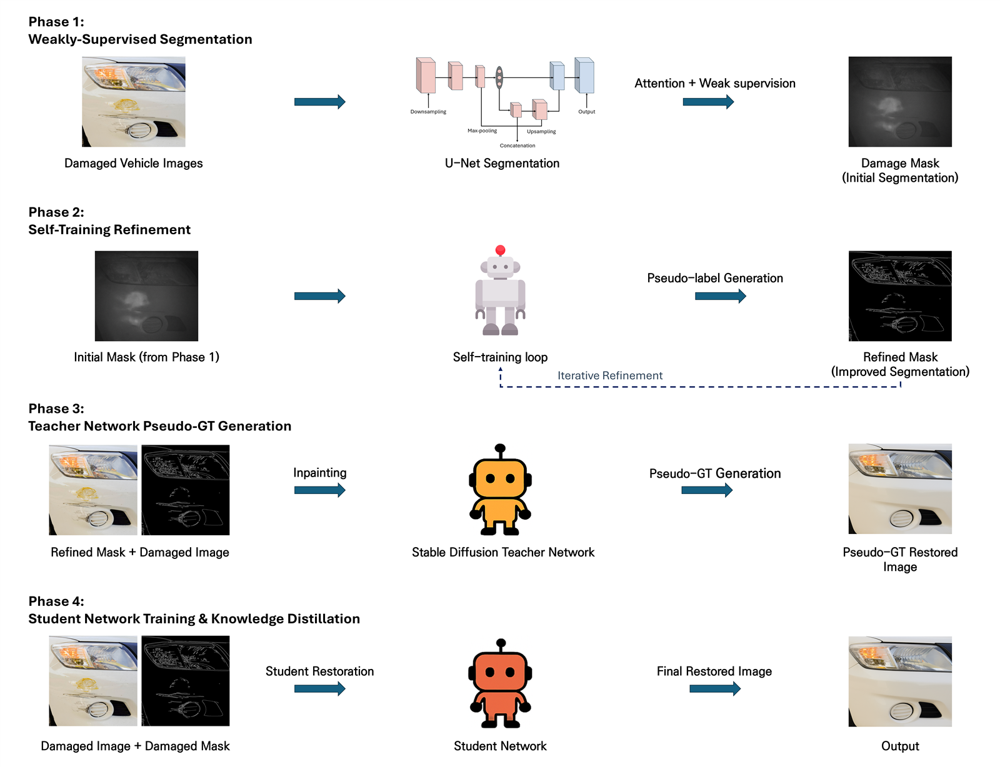
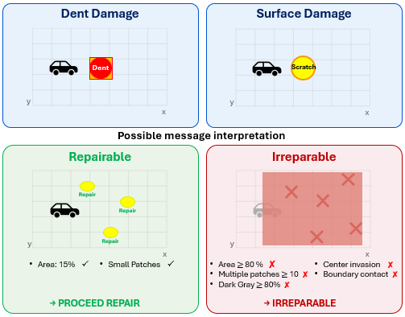
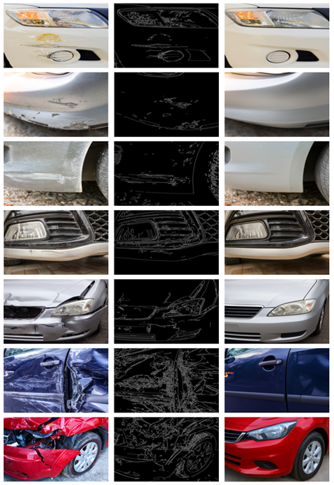

<div align="center">

# DualNet-R

### Dual-Network Surface Restoration with Diffusion-Based Pseudo-Ground Truth Generation

[](https://doi.org/10.5281/zenodo.22660522)
[](https://www.python.org/)
[](https://pytorch.org/)
[]()

*Official implementation — submitted to* **Scientific Reports** *(under revision).*

</div>

---

## Overview

Surface-damage restoration in industrial settings faces a fundamental supervision gap: **paired before/after images do not exist** for real damage. DualNet-R closes this gap by distilling the generative capability of a frozen Stable Diffusion inpainting **teacher** into a lightweight, single-pass **student** network, using diffusion-generated **pseudo-ground truth (pseudo-GT)** as the sole restoration supervision. The framework couples this with weakly-supervised damage localization and an **interpretable, rule-based irreparability assessment** that decides — before any restoration is attempted — whether a surface is recoverable at all.

The result is a deployment-oriented system: the diffusion model is removed from the inference path entirely (**859.5M → 31.4M parameters**), and restoration quality is judged not by pixel fidelity alone but by human perception — where DualNet-R is decisively preferred.

<div align="center">

<br><em>The four-phase DualNet-R pipeline: weakly-supervised segmentation &rarr; self-training refinement &rarr; teacher pseudo-GT generation &rarr; student distillation.</em>
</div>

## Key Contributions

1. **Weakly-supervised diffusion→student transfer.** An offline, response-based distillation framework in which a frozen Stable Diffusion inpainting teacher supervises a single-pass student through mask-composited pseudo-GT — no paired data, no diffusion steps at inference.
2. **Integrated interpretable irreparability assessment.** Five auditable criteria (damage area ≥ 80%, center invasion with area ≥ 70%, patch count ≥ 10, four-edge contact, dark-gray coverage ≥ 80%) gate the restoration stage, matching the traceability requirements of insurance workflows.
3. **Evidence across three axes.** Multi-dataset evaluation with statistical hypothesis testing (paired Wilcoxon, 95% CIs), a protocol-documented human study (Fleiss' κ = 0.908), and measured latency under an identical hardware/software stack.

## Method

Four sequential phases; each stage consumes the previous stage's output:

| Phase | Component | Specification |
|---|---|---|
| 1 | Weakly-supervised segmentation | Attention U-Net: 4-stage encoder–decoder (64–128–256–512), 1,024-ch bottleneck, additive attention gates on all skips, 31.4M params |
| 2 | Self-training refinement | Sigmoid maps binarized at 0.5; single refinement round over all 2,816 training images |
| 3 | Teacher pseudo-GT generation | `stabilityai/stable-diffusion-2-inpainting`, DDIM, 50 steps, guidance 7.5, η = 0, per-image deterministic seeding (seed + index), negative prompt `"blurry, distorted, unrealistic"`, mask-based compositing (undamaged pixels identical to input) |
| 4 | Student distillation | 4-ch input (RGB + mask), tanh head, mask-weighted L1 (2× inside mask); Adam, lr 1e-4, batch 8, StepLR ×0.5 / 40 epochs |

<div align="center">

<br><em>Irreparability decision logic: repairable vs. irreparable configurations under the five auditable criteria.</em>
</div>

**Reproducibility.** All experiments use the official CarDD-SOD splits (**2,816 / 810 / 374**) and a fixed random seed of **42** for data splitting, weight initialization, and pseudo-GT generation.

## Results

<div align="center">

<br><em>Qualitative comparison on CarDD test images.</em>
</div>

### Restoration quality vs. efficiency (CarDD test split, n = 374)

| Method | PSNR ↑ | SSIM ↑ | Params | Relative latency |
|---|---|---|---|---|
| DiffIR | **24.2** | **0.85** | 859.5M (pipeline) | 3.8× |
| **DualNet-R (ours)** | 22.8 | 0.84 | **31.4M** | **1× (8.0 FPS, RTX 3070 Ti)** |

DiffIR's edge on distortion metrics is small but statistically significant (paired Wilcoxon on per-image metrics, *p* < 1e-8 across comparisons; 95% CIs exclude zero — see the paper's Supplementary Table S1).

### Human perceptual evaluation (blinded 3-AFC, 15 raters × 50 pairs)

| Metric | Value |
|---|---|
| Preference for DualNet-R (decisive judgments) | **96.5%** (719 / 745) |
| Pairs won by majority | **49 / 50** |
| Unanimous pairs (15/15 raters) | 39 — all favouring DualNet-R |
| Inter-rater reliability | Fleiss' **κ = 0.908** (agreement 95.4%) |

The dissociation between distortion metrics and human preference instantiates the **perception–distortion trade-off** (Blau & Michaeli, CVPR 2018): the iterative baseline minimizes pixel-wise error, while the single-pass student produces reconstructions that human observers judge as better restorations.

### Component ablation (original protocol)

| Configuration | PSNR ↑ | SSIM ↑ | LPIPS ↓ | FID ↓ |
|---|---|---|---|---|
| **DualNet-R (full)** | **22.8** | **0.84** | **0.19** | **28** |
| w/o pseudo-GT generation | 21.5 | 0.81 | 0.23 | 35 |
| w/o Stable Diffusion | 21.9 | 0.82 | 0.21 | 33 |
| w/o self-training | 22.1 | 0.82 | 0.20 | 31 |
| Baseline U-Net | 20.8 | 0.79 | 0.25 | 38 |

Component-interaction ablations under a seeded reproduction protocol (joint removals, attention-gate analysis, per-image significance) are reported in the revised paper; removing pseudo-GT alone is the single most damaging configuration (−1.08 dB, *r* = 0.78), and self-training acts as an **amplifier of whatever restoration target it is given** rather than an independent contributor.

Cross-dataset evaluation retains **91–99% PSNR** across acquisition-condition shifts within the vehicle domain.

## Installation

```bash
git clone https://github.com/Jieuny1208/DualNet-R.git
cd DualNet-R
pip install -r requirements.txt
```

Core dependencies: `torch`, `diffusers`, `transformers`, `opencv-python`, `scikit-image`, `numpy`.

## Dataset

Obtain **CarDD** (Car Damage Detection) from its official distribution and place the SOD subset under `data/` following the official splits. The dataset is not redistributed here; please observe its original license.

## Usage

```bash
# Phase 1–2 · segmentation + self-training
python <segmentation_training_script>.py

# Phase 3 · pseudo-GT generation (SD teacher)
python <pseudo_gt_generation_script>.py

# Phase 4 · student distillation
python <student_training_script>.py

# Inference · segmentation → irreparability check → restoration
python <inference_script>.py --input path/to/image.jpg
```

*(Replace the placeholders with the actual script names in this repository.)*

## Citation

```bibtex
@article{dualnetr2026,
  title   = {DualNet-R: Dual-Network Surface Restoration with Diffusion-Based
             Pseudo-Ground Truth Generation},
  author  = {Lee, Jieun and Kim, Tae-yong and Kim, Doohong and Jeong, Jongpil},
  journal = {Scientific Reports (under revision)},
  year    = {2026}
}
```

## Archive

This repository is permanently archived at Zenodo — version v1.0.0: [10.5281/zenodo.22660523](https://doi.org/10.5281/zenodo.22660523) · all versions: [10.5281/zenodo.22660522](https://doi.org/10.5281/zenodo.22660522).

## License & Acknowledgments

Code is released for academic research. CarDD and Stable Diffusion weights are governed by their respective licenses. This work was conducted at **AIFactoryLab, Sungkyunkwan University**.
